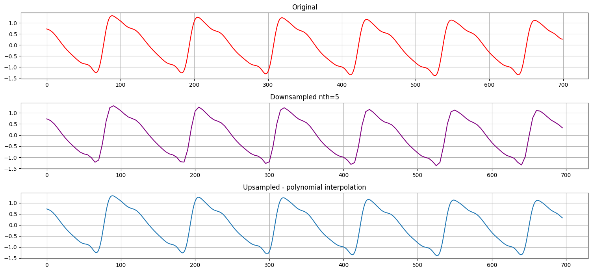

# Seerlinq tech task

## PPG data merging

You are given two files containing PPG data in the netCDF format. These come from the same patient but in different conditions, measured approximately 20-30 seconds after one another (the order of measurements does not matter). The PPG data contain three channels: red, infra-red (IR), and "pleth" - the pleth is a linear combination of red and IR, but we treat it as an independent channel.

Your task is to research, implement, test, and analyze methods for merging these two conditions in a way they appear as a single PPG time series. The final merged PPG needs to contain all three channels. The choice of whether to use multivariate methods or univariate methods is yours. You can use any resource and any Python library you'd find helpful.

Please submit your conclusions within two weeks in two ways:

* A concise English report (preferably PDF or md) summarizing your approach, decisions, and findings about the task.
* a Python script that can be directly run given the two files, outputting merged PPG data in any reasonable format

# Usage
In python3 environment install required packages ``pip install -r requirements.txt``
then main PPG module can be executed as follows ``python -m ppg`` 

use ``python -m ppg merge --help`` to navigate through. To merge two time series use use ``python -m ppg merge <ts1_path> <ts2_path>``

### Input example:

### Output:

## How it works
### Autoregressive weighted gap modeling
Gap is modelled in autoregressive way using two regression models, one trained on data before and second on data after the gap (see Pipeline diagram.).
Each prediction is weighted combination (sigmoid) of both models, considering relative position in the gap
to model smooth transition of frequency spectrum, signal shape and overall distribution. Extracted features used for regressions
are: lagged values, long-term moving metrics - mean, std, signal upper and lower envelopes and its derivations.
Autoregressive model is working with down-sampled signal to address computation performance.  

#### Pipeline diagram

## What didn't work
- **STFT phase + magnitude interpolation** (unable to interpolate phase correctly -> corrupted inverse transform)
- **STFT phase + magnitude convolution** (gaussian, median filter 1D/2D -> perfect magnitude transition, poor phase modeling)
- **STFT magnitude interpolation + phase reconstruction** (better, but still corrupted inverse transform)
- **STFT phase + magnitude modeling** (used CNNs, LSTMs, Transformer to model both magnitude and phase, unsuccessfully)
- **LSTM many-to-many** on several learning tasks (next sequence prediction, gap fulfillment, bidirectional, randomly masked, sliding windows) - 
poor quality of signal generated signal, computation cost
- **LSTM many-to-one** on several learning tasks (next token prediction, autoregressive, regression, regression + FFT features) 
good signal quality, but can't handle long term modeling. 

Overall, main problem of STFT approaches was the PHASE construction. And so I have decided to model signal in time domain. 
Regarding Deep Learning approaches, I faced two extremes:
- good signal quality, but poor long-term behavior and computation costs
- poor signal quality, but good long term behaviour, reasonable computation cost

According to these findings I have found compromised approach 
- to use autoregressive short-term regression (lagged values) for good signal quality
- to use aggregated moving features to address long-term modeling, precision and robustness

For such case expensive LSTMs are not necessary, I have chosen RandomForestRegressor.

# Report: PPG signal modeling

## Author's Note
In this report, I described how I approached the assigned task to merge two time-series with 3-channels of clinical data, 
PPG (Photoplethysmography) RED, IR, PLETH namely. Please, consider this report as a work-in-progress concept,
as it contains the authors' thoughts, notes, and unverified conclusions. 
The grammar and wording were not checked. You can find more info descriptions in code and docstrings.

### Physical and medical terms
- Light absorption (At least two different wavelengths)
- Blood / Arterial oxygen saturation (SaO2) [percentage of oxygenated haemoglobin]
- Partial pressure of oxygen in the blood (SpO2) 
- Blood / Arterial pressure waveform (ABP) 
- Heart beat rate
- Respiration rate / Breathing
- Blood circulation
- Blood volume
- Cardiovascular monitoring
- Hypovolemia
- DC component - offset, glucose correlations 
- Frequency, frequency spectrum
- Signal shape
- Trend, Seasonality, Volatility, Outliers, Artifacts, Anomalies

# Introduction
Photoplethysmography is a non-invasive method for measurements of the cardiac cycle by sensing blood absorption under at 
least two different light wavelengths (RED, IR). Differences in light absorption correspond to the percentage 
of oxygenated/non-oxygenated hemoglobin in the blood - Arterial oxygen saturation (SaO2).
Among obvious downstream measurable clinical processes such as heartbeat, blood flow, and pressure, there are several not such straightforward 
processes that can be obtained and analyzed. PPG data have been proven to imply causality with the respiratory process, breathing rate, 
stress level glucose, etc. Raw data can contain several ambient and noisi signals. 
Amount of ambient light may be varying, depending on measurement conditions and particular sensor hardware implementation. 
The most addressed noisy patterns caused by external measurement conditions are referred to as moving artefacts. 
In this work, I will simplify and limit the wide complexity of this interesting sensing. 
Because of the lack of understanding of clinical processes, consequences, relationships and limited time for research, 
I will not provide any medical analysis or conclusions. 
Thus, there might be doubt if the best-suited preprocessing or optimal modeling approach will be used at all.

There are several motivations behind merging two PPG time series with the gap of missing data between each other, 
including continuity of data analysis, particular algorithm requirements, development, 
and visualizations for data-driven decisions. On the other hand, modeling unknown data will cause uncertainty and unwanted biases,
which we need to mitigate as much as possible.
Overall the solution to the assigned problem is to model/predict/approximate missing data. 
The suggested approach is divided into two parts: signal processing and data imputation.

Data imputation or modeling of such large amount of missing values is basically synthetization of dataset,
since data are generated. This can bring unwanted distribution differences.

Related work within PPG time series analysis seems to be well known researched generally.
But its potential using advanced machine learning had been revealed recently. 
Regarding time-series modeling, there is enormous amount of sources to be usefully. 
For example audio signal processing is well researched. 
Firstly, we need establish high-level objectives and simplifications for our analysis.

Citation: **"The photoplethysmogram is a function of the underlying circulation, but the relation is complicated by optical,
biomechanical, and physiologic covariates that affect the appearance of the photoplethysmogram."**

# Approach and Methodology
As touched in Introduction, there are several clinical processes which can be analyzed. 
Selected downstream analysis (either classification, anomaly detection, scoring, .etc) 
and "business" use case (cardiac disses detection, heart-beat timing analysis, and much more I don't even know about) will affect and shape,
how optimal preprocessing pipelines have to be designed. I am not going to select specific analysis, 
rather I will just try to approach solution in the generic way. I mean, keeping as much information in data as possible, filter noise,
while providing well-distributed and scaled time series suited for following analysis. Practically I will focus on frequency spectrum,
time-frequency gap alignment.

Rather than choosing processing and modeling methods based on clinical task, I will follow provided data characteristics.
Let's then continue with data analysis. I need to find and establish assumptions to select right preprocessing and model.
Then I will implement processing and filtering as partial task.

## Objectives, goals and assumptions

### High level objectives and goals
- Minimal information loss
- Model large gap in the full width
- Use features from before and after gap
- Signal shape and quality 
- Frequency spectrum transition and alignment
- Phase alignment

### Objectives and evaluations
- Time domain visual check (shape, amplitude, trend, volatility, ...)
- Frequency spectrum visual check (STFT - smooth transition)
- MSE, MAE, ..

## Data Analysis and Assumptions

### Trends
There is no single trend in data, rather we are dealing with low-frequency fluctuation. This is often referred as DC component.
This variable offset may also hold clinical information (glucose process), but it is not suited for our generic analysis and we will get rid of it. 
Please visit `notebooks/fft_analysis.ipynb` there is step by step FFT analysis with filtering decisions, providing such outcomes:

### Volatility
When it comes to volatility of single measurement it looks fine. 
But it differs across measurements and conditions. The amplitude of signal just stands for
physical and electrical intensity of signal. The intensity may be affected by external conditions 
like skin moisture, placements, positions, finger width, but it could also be correlating with blood pressure, volume and flow.
And that is also where I don't want to lose information in my analysis.

### Seasonality
We talk rather about periodicity than seasonality.
since we don't do long (days) continuous measurements in the same conditions.

### Stationary
We need to recognize if data has some time-dependent structure and transform to omit such behavior.
We can use tests like Augmented Dickey–Fuller, etc. For some statistical models this is crucial assumption.

### Outliers, Artefacts, Anomalies
No advanced technique were adopted in this research work. Manual visual analysis should be enough. 
Although it would be interesting to analyse and classify such artefacts,
it would require expert knowledge and would be definitely part of further research. 

### Thought on Decompositions
Next topic to consider is, in which space and composition we are going to process data.
There are several approach depending on data and assumptions. 
Most likely FFT frequency spectrum can be used for analysis followed by inverse decomposition.
Since we are facing changes in frequency, some time distributed (discrete) approach would be usefully.
Short Time Fourier Transform or Wavelet.
Another decomposition occurs when dealing with stationary transformations or scaling, etc.

## Signal processing
Signal processing and time-series in general are not really my cup of tea, in contrast to other data structures I have worked with.
On the other hand, these are the most common structures in nature and thus my excuse is not addressed well. 
From electrical engineering and embedded software development I knew a bit about noise reduction, preprocessing, etc. 
From discrete system controlling and math classes I remember Fourier transform analysis, Interpolations etc. 
Remaining required knowledge I will learn and research ondemand and also adopt from my more familiar data science area.
Preprocessing should include normalization, scaling, standardization and outliers removal.

To simply merge two time series, without effort to model gap, I am thinking about some kind of **interpolation**. 
I will definitely try my very secret weapon - "**The Kalman Filter**"! As it helps many times in digital signal processing.
Kalman Filter supports even multivariate computations. 
I have used it to filter noise, but I have really found it amazing while dealing with Inertial Measurement Units (IMU), 
where gyroscopes, accelerometers, magnetometers and GPS contribute to signal fusion. (It turns out to be useless. :D)

### Handle missing values
To handle randomly missing time steps, polynomial interpolation was added into preprocessing pipeline.

### FFT analysis and Filtering
Obviously there is significant difference in frequency spectrum before and after gap.
FFT spectrum histogram of RED channels (after bandpass filtration):
 

Since sampling frequency Fs is 100Hz, according to Nyquist–Shannon sampling theorem 
we will analyse frequencies no greater than Fs/2.0 = 50Hz. Moreover, it may be possible to down-sample signal...

#### Heart Beat
We definitely need to keep heartbeat frequency in full range.
consider minimal frequency for athletes in calm conditions 40BPM -> 0.67 Hz
let's choose cut-off frequency smaller than 0.67Hz

#### Breathing rate
Considering breathing rate, as it would be present in frequency spectrogram reaching low frequencies
The average breathing rate for adult at rest is 0.1 - 0.4 Hz,  while muscles work harder, breathing rate can reach 1Hz or even more
Let's assume, if there is significant magnitude in breathing frequency range -  we are detecting breathing process
unfortunately I don't see such peak, but at least, we will consider it in Low-pass filter adjustment. 
(it may be frequency close to heart-beat, as there are multiple peaks)
Finally, let's choose cut-off frequency 0.05, since the breathing will be at higher frequency.

#### Band Pass Filter
Second time series contains low frequency DC offset at the end, which wasn't filtered by High-Pass. Definitely unwanted behavior.
After researching, I found it is called the Ringing effect or Gibbs phenomenon.

I've solved it using custom padding.

### Normalization
Zscore normalization was used in preprocessing pipeline as the property of zero mean and variance scaling really helps
to model long term features.
MinMax scaler in range (0, 1) was used in postprocessing only.

### Data imputation
Considering the size missing value to be modeled, the term imputation is no more relevant for us.

### Simplifications
 - Provided solution is designed for postprocessing rather than real-time analysis.
 - Loss of long-term trend information - DC offset

## Methods
## Time series algorithms
### Statistical Models
#### Uni-variate Models
- Exponential Smoothing
- Moving Average Models
- ARIMA
- ARCH/GARCH
- PROPHET
#### Multi-variate Models
- Vector Auto Regressors
- ...

### Machine Learning Models
- Regressors
- Autoregressive NNs
- Neural Prophet
- Auto-encoders
- Random Forests
- Bayesian Autoregressive Models
- Markov Chain

### Statistics models
ARIMA (AutoRegressive Integrated Moving Average) as it can be train on data before and after gap
But there is a change in frequency in data (hear-beat) and significant periodicity...
Change in frequency doesn't follow stationary assumptions. Also, I have never used it before :D

Statistical approach conclusion: Didn't work well for such long gaps, unstable.

### Short-Time Fourier Transform 
I spend great amount of time dealing with Short-Time Fourier Transform to (STFT) to model changing frequency across conditions
I had several ideas how to use purely mathematical methods to model gap this way.

#### STFT magnitude interpolation
Magnitude interpolation was wrong by design.

#### STFT 2D convolution (median filter)
The modeled gap in following picture starts on x=90 and ends on x=110. 

## Non-conventional ideas
To use ML deep learning to model overlaped part between gap and end/start of time series
The overlap loss optimization would ensure data continuity and it is basically what I would expect, at all.
Some kind of seq2seq autoencoder with custom loss function could handle it.
Similarly, like BERT do (bidirectional encoder representation from Transformers) use Masked language model.
I will adopt masked ppg time series approach. Which will basically mask overlaping window of signel near the GAP.
And only such window wil be used for reconstruction - backprop optimization.
Additionally, I will mask few random small windows in time series to increase learning capabilities.
1 random window per series and per epoch/sample ... Didn't worked as expected

What about combine frequency information with time series modeling using deep learning (LSTM)
For each training step I can provide model with actual value and frequency spectrum features.
Then for the gap prediction I will interpolate frequency spectrum to align linearly.

### Generative Models
GANs, VAEs - these are nice, but not suitable for benchmark implementation, since there are tricky and not robust. 

### State Space Models and Kalman Filter
Tried, the results and implementation were disappointing

### Self-Supervised methods
- pretrained auto-encoders

### Autoencoders
- denoising auto-encoders for filtering and artefact removal
- to address small amount of labeled data

### Contrastive learning
- to compare measurements in different conditions

## Implementation

### Alignment

Sigmoid weighting was used in autoregressive prediction to obtain smooth transition from modeled data before and after gap.

### Long-term features
The RF regressor based solely on lagged values worked perfect, considering signal shape and frequency spectrum transition.
But I wanted to model low frequency trends in signal. These volatilities may seem like amplitude modulation, 
bet there is a pattern in differences between upper and lower envelopes:

I have extracted envelopes as peak indices on the upper and lower side of signal.

Moving standard deviation:

See ``ppg/models/autoregressive_gap_model.py`` for more implementation details.

### Down sampling
It seems safe to down-sample signal 5 times and so increase computation performance. 

# Future work
## Robust Deep Learning solution
There are several interesting deep learning ideas I have not tested yet.

## Datasets
Even thought I was provided by just single case of measurement, it would be reasonable to approach the task considering
more real-world data. I have to choose some public open dataset with PPG data.

- VIPL-HR
- PURE
- MIMIC III
- UBFC-rPPG

## Evaluation strategies
- (Rolling) Time widows
- Cross Validation
- Split into segments
- Visual validation
- Statistical tests

## Hypermarket tuning
Regarding evaluation strategies, I need to construct objectives if I will have time to run hyperparameter optimizations.
This would be nice also for traditional models. https://optuna.org/

## Known limitation
- Artefact removal (none was used)
- Robustness (for some kinds of time series, model fails to model gap correctly)
- After gap phase alignment (no advanced technique adopted)

# Conclusion
I would establish this work as successful. 
Even though I have been struggling with a lack of domain expertise and experience in both clinical PPG analysis and time series in general,
I have enjoyed the work and research. The provided solution follows and handle my desired objectives, which were:
to model the whole gap with minimal data filtration, smooth alignment of frequency spectrum, high resolution signal shape, model long term features.

On the other hand, the current solution has not been proven to be robust for all kinds of input time series.
The robustness, computing performance, and in-sample objective evaluation have to be addressed in further research. 

I have analyzed multiple statistics and machine learning methods, resulting in the compromised implementation
using Random Forest Regression which was tasked to predict N_LAGS lagged time step with several long-term moving and windowing features.
The model was then used in an autoregressive way to model the gap in the forward direction step by step. 
The limitation of such an approach is the phase and amplitude alignment with data after the gap.

## Resources
Most of used resources are not in this list.

https://biomedical-engineering-online.biomedcentral.com/articles/10.1186/1475-925X-13-50

https://pubs.asahq.org/anesthesiology/article/108/5/950/8368/Utility-of-the-Photoplethysmogram-in-Circulatory

https://iopscience.iop.org/article/10.1088/0967-3334/28/3/R01/meta (most citations at Google Scholar)

https://arxiv.org/pdf/2306.02301.pdf - 4th June 2023 - rPPG-MAE: Self-supervised Pre-training with Masked Autoencoders for Remote Physiological Measurement

https://www.ncbi.nlm.nih.gov/pmc/articles/PMC3074241/

https://mdpi-res.com/d_attachment/sensors/sensors-20-05045/article_deploy/sensors-20-05045.pdf?version=1599291834

